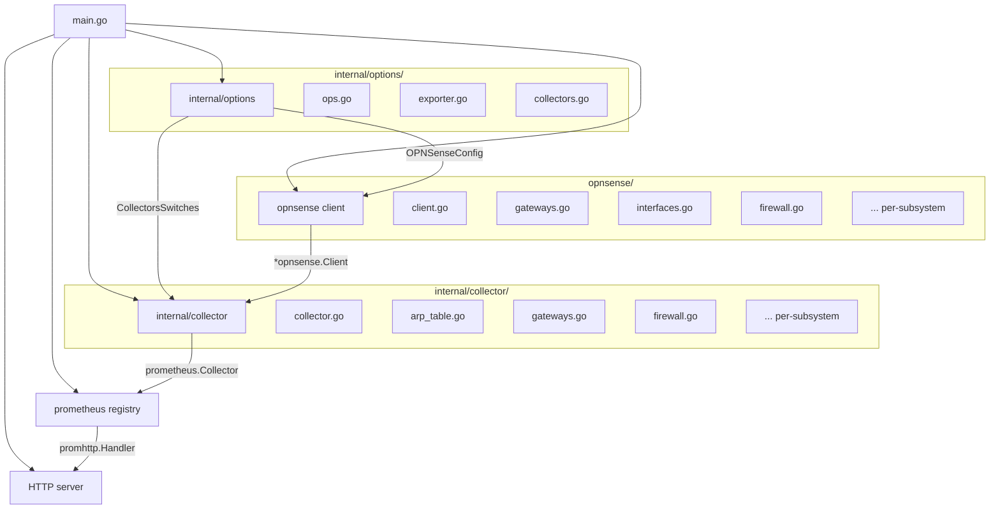
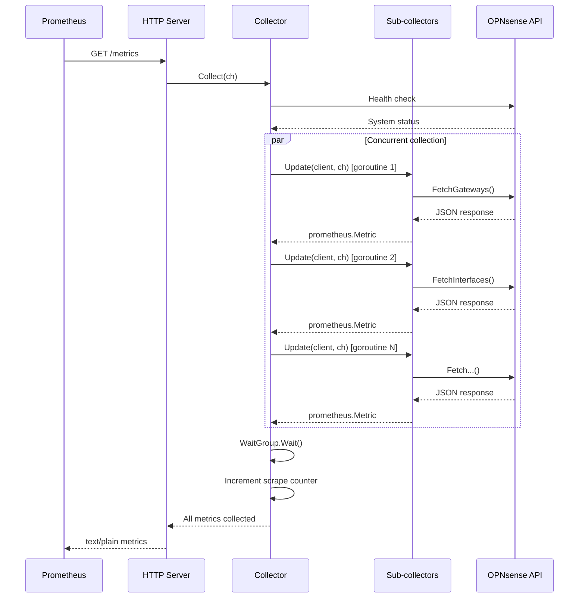

# Architecture

This page describes the internal architecture of the OPNsense Exporter, including its package structure, data flow, and extension points.

## Package structure



## Three main packages

### `opnsense/` -- API client

The API client layer handles all communication with the OPNsense REST API. Each subsystem has a dedicated `Fetch*()` method (e.g., `FetchGateways()`, `FetchWireguardConfig()`, `FetchSystemTemperature()`).

**Client features:**

- **TLS support** with configurable certificate verification
- **Basic authentication** using API key and secret
- **Automatic retries** up to 3 attempts on transient failures
- **Gzip decompression** for compressed API responses
- **Registered endpoints** tracked for error reporting

Data structs for JSON unmarshaling live alongside each `Fetch*()` method.

### `internal/collector/` -- Prometheus collectors

This package contains the top-level `Collector` struct and all 26 sub-collectors. Each sub-collector lives in its own file and implements the `CollectorInstance` interface:

```go
type CollectorInstance interface {
    Register(namespace, instance string, log *slog.Logger)
    Name() string
    Describe(ch chan<- *prometheus.Desc)
    Update(client *opnsense.Client, ch chan<- prometheus.Metric) *opnsense.APICallError
}
```

**Key design decisions:**

- **Auto-registration via `init()`** -- Each sub-collector file has an `init()` function that appends itself to the global `collectorInstances` slice. No central registry to maintain.
- **Concurrent collection** -- On each scrape, `Collector.Collect()` launches all sub-collectors as goroutines via a `sync.WaitGroup`, collecting metrics in parallel.
- **Option pattern** -- Sub-collectors are removed or configured via functional options (e.g., `WithoutArpTableCollector()`, `WithFirewallRulesDetails()`).

### `internal/options/` -- Configuration

Configuration is handled via [kingpin](https://github.com/alecthomas/kingpin) CLI flags with corresponding environment variables:

- **`ops.go`** -- OPNsense connection config (protocol, address, API key/secret, TLS)
- **`exporter.go`** -- Server config (listen address, metrics path, instance label)
- **`collectors.go`** -- Per-collector disable/enable switches

All environment variables use the `OPNSENSE_EXPORTER_` prefix, except for `OPS_API_KEY_FILE` and `OPS_API_SECRET_FILE`.

## Data flow



### Scrape lifecycle

1. Prometheus sends `GET /metrics`.
2. The `Collector.Collect()` method acquires a mutex and runs a health check against the OPNsense system status API.
3. If the health check fails, `opnsense_up` is set to 0 and no sub-collectors run.
4. If healthy, all enabled sub-collectors are launched concurrently as goroutines.
5. Each sub-collector calls its `Update()` method, which invokes one or more `Fetch*()` methods on the API client and emits metrics to the shared channel.
6. The main collector waits for all goroutines to complete, then increments the scrape counter and emits endpoint error counters.

### Error handling

- **Health check failure:** Sets `opnsense_up=0`, skips all sub-collectors.
- **Sub-collector failure:** Logs the error, increments `opnsense_exporter_endpoint_errors_total` for the failing endpoint. Other sub-collectors continue unaffected.
- **Partial failure tolerance:** Several collectors (system info, mbuf memory stats, firewall interface hits, network diagnostics pfsync) are partially failure tolerant -- if an optional supplementary API call fails, the collector still emits metrics from successful calls.

## Metric namespace

All metrics use the `opnsense` namespace prefix. The subsystem constants define the second-level grouping:

| Constant | Value |
|----------|-------|
| `ArpTableSubsystem` | `arp_table` |
| `GatewaysSubsystem` | `gateways` |
| `InterfacesSubsystem` | `interfaces` |
| `ProtocolSubsystem` | `protocol` |
| `FirewallSubsystem` | `firewall` |
| `FirewallRulesSubsystem` | `firewall_rule` |
| `FirmwareSubsystem` | `firmware` |
| `SystemSubsystem` | `system` |
| `TemperatureSubsystem` | `temperature` |
| `UnboundDNSSubsystem` | `unbound_dns` |
| `DnsmasqSubsystem` | `dnsmasq` |
| `MbufSubsystem` | `mbuf` |
| `NTPSubsystem` | `ntp` |
| `CertificatesSubsystem` | `certificate` |
| `CARPSubsystem` | `carp` |
| `ActivitySubsystem` | `activity` |
| `KeaSubsystem` | `kea` |
| `NetworkDiagSubsystem` | `network_diag` |
| `NetflowSubsystem` | `netflow` |
| `PFStatsSubsystem` | `pf_stats` |
| `NDPSubsystem` | `ndp` |

## Profiling

The exporter includes built-in profiling support via Go's `net/http/pprof` and [godeltaprof](https://github.com/grafana/pyroscope-go) (Pyroscope). Profiling endpoints are available at `/debug/pprof/*` and support:

- CPU profiling
- Memory (heap) profiling
- Mutex contention profiling
- Block profiling
- Goroutine dumps

This is compatible with Grafana Alloy pull-mode scraping for continuous profiling.
