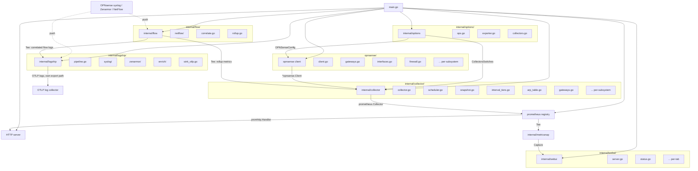
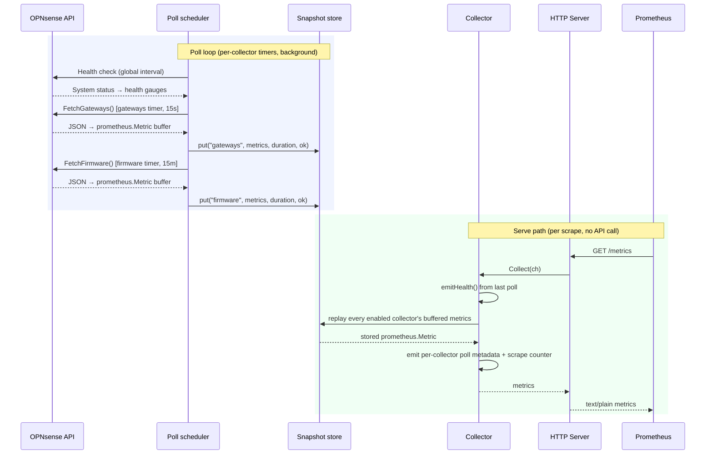

# Architecture

This page covers the exporter's internal architecture: package structure, data flow, and extension points.

It describes the code in the
[rknightion/opnsense-exporter repository on GitHub](https://github.com/rknightion/opnsense-exporter),
which is Apache-2.0 licensed. Package and file names below are paths in that repository.

## Package structure


```mermaid
graph TD
    A[main.go] --> B[internal/options]
    A --> C[opnsense client]
    A --> D[internal/collector]
    A --> E[prometheus registry]
    A --> F[HTTP server]
    A --> G[internal/logship]
    A --> N[internal/flow]
    A --> W[internal/webui]

    Push[OPNsense syslog / Zenarmor / NetFlow] -.push.-> G
    Push -.push.-> N

    B -->|OPNSenseConfig| C
    B -->|CollectorsSwitches| D
    C -->|*opnsense.Client| D
    D -->|prometheus.Collector| E
    E -->|promhttp.Handler| F
    E -->|Tee| M[internal/metricsnap]
    M -->|Capture| W
    N -->|Tee: rollup metrics| D
    N -->|Tee: correlated flow logs| G
    G -->|OTLP logs, own export path| O[OTLP log collector]

    subgraph "opnsense/"
        C
        C1[client.go]
        C2[gateways.go]
        C3[interfaces.go]
        C4[firewall.go]
        C5[... per-subsystem]
    end

    subgraph "internal/collector/"
        D
        D1[collector.go]
        D6[scheduler.go]
        D7[snapshot.go]
        D8[interval_tiers.go]
        D2[arp_table.go]
        D3[gateways.go]
        D4[... per-subsystem]
    end

    subgraph "internal/options/"
        B
        B1[ops.go]
        B2[exporter.go]
        B3[collectors.go]
    end

    subgraph "internal/logship/"
        G
        G1[pipeline.go]
        G2[syslog/]
        G3[zenarmor/]
        G4[enrich/]
        G5[sink_otlp.go]
    end

    subgraph "internal/flow/"
        N
        N1[netflow/]
        N2[correlate.go]
        N3[rollup.go]
    end

    subgraph "internal/webui/"
        W
        W1[server.go]
        W2[status.go]
        W3[... per-tab]
    end
```

## Seven packages

### `opnsense/` - API client

The API client layer handles all communication with the OPNsense REST API. Each subsystem has a dedicated `Fetch*()` method (e.g., `FetchGateways()`, `FetchWireguardConfig()`, `FetchSystemTemperature()`).

**Client features:**

- **TLS support** with configurable certificate verification
- **Basic authentication** using API key and secret
- **Automatic retries** up to 3 attempts on transient failures
- **Gzip decompression** for compressed API responses
- **Registered endpoints** tracked for error reporting

Data structs for JSON unmarshaling live alongside each `Fetch*()` method.

### `internal/collector/` - Prometheus collectors

This package contains the top-level `Collector` struct and all 64 sub-collectors. Each sub-collector lives in its own file and implements the `CollectorInstance` interface:

```go
type CollectorInstance interface {
    Register(namespace, instance string, log *slog.Logger)
    Name() string
    Describe(ch chan<- *prometheus.Desc)
    Update(ctx context.Context, client *opnsense.Client, ch chan<- prometheus.Metric) *opnsense.APICallError
}
```

**Key design decisions:**

- **Auto-registration via `init()`** - Each sub-collector file has an `init()` function that appends itself to the global `collectorInstances` slice. No central registry to maintain.
- **Poll/serve split (#336)** - Sub-collectors do not run on the scrape. An internal poll scheduler (`scheduler.go`) runs each collector's `Update()` on its own timer into an in-memory snapshot (`snapshot.go`); serving `/metrics` replays that snapshot and makes no API call. See [Data flow](#data-flow).
- **Per-collector poll tiers** - Each collector's timer follows its data-volatility tier (`interval_tiers.go`): fast 15s, medium 60s (default), slow 5m, cold 15m. An operator overrides one with `--collector.poll-interval-override=<collector>=<dur>`.
- **Poll cadence follows the consuming export lane (#550)** - When OTLP is a delivery path, a collector polls at `max(tier interval, export-lane interval)` (`poll_lane.go`), so it never fetches from the firewall faster than the lane that reads the result. The rule only ever slows polling down, an operator override still wins outright, and scrape-only deployments are untouched. The lane clamp deliberately sits *above* `resolveInterval`, because fast-lane membership is derived from the declared interval and folding the clamp in would make the two define each other.
- **Option pattern** - Sub-collectors are removed or configured via functional options (e.g., `WithoutArpTableCollector()`, `WithFirewallRulesDetails()`).

### `internal/options/` - Configuration

[kingpin](https://github.com/alecthomas/kingpin) CLI flags handle configuration, each with a corresponding environment variable:

- **`ops.go`** - OPNsense connection config (protocol, address, API key/secret, TLS)
- **`exporter.go`** - Server config (listen address, metrics path, instance label)
- **`collectors.go`** - Per-collector disable/enable switches

All environment variables use the `OPNSENSE_EXPORTER_` prefix, except for `OPS_API_KEY_FILE` and `OPS_API_SECRET_FILE`.

### `internal/logship/` - Log shipping

Backs the README's syslog and Zenarmor receiver rows. Unlike the packages above, this one is **push-based**: OPNsense (and, separately, Zenarmor) send data to the exporter over the network; the exporter never polls for it. Its subpackages:

- **`syslog/`** — a UDP/TLS syslog listener (`listener.go`, `framing.go`) plus a per-program parser registry (one file per program: `filterlog.go`, `dhcp.go`, `sshd.go`, `haproxy.go`, `suricata.go`, `audit.go`, and more), each turning a raw syslog line into a structured record.
- **`zenarmor/`** — a dedicated HTTP receiver (`server.go`) for Zenarmor's own event stream, with its own parsing and derived metrics.
- **`enrich/`** — attaches device/service context (MAC, hostname, service name) to log records from a periodically refreshed snapshot, independent of the collector snapshot in `internal/collector`.
- **`capture/`** — optional raw-line capture for debugging, with de-duplication.
- **`flowlog/`** — the sink that `internal/flow`'s correlator writes merged flow logs into, so flow logs travel the same pipeline and OTLP sink as syslog-derived logs.
- Top-level files (`pipeline.go`, `queue.go`, `sink.go`, `sink_otlp.go`, `sink_stdout.go`) run the receive → parse → enrich → queue → ship loop and hand records to the configured `Sink`, most commonly the OTLP log sink (`sink_otlp.go`), which exports over `otlploggrpc`/`otlploghttp` independently of the metrics path.

### `internal/flow/` - NetFlow processing

Backs the README's NetFlow/flow-volume row (#346). Also push-based: OPNsense's `ng_netflow` exports NetFlow datagrams to a UDP listener here, rather than being polled. `netflow/` decodes the wire format; `processor.go` runs each datagram through normalize → repair → enrich → rollup, in that order (repair must run before enrich so a de-duplicated VLAN copy is dropped before it would be double-named and double-counted). `rollup.go` turns records into the `netflow_*` Prometheus metrics collected via `internal/collector`. `correlate.go` separately collapses NetFlow's 1:N fragmentation into one flow record per connection-window, merging in Zenarmor's L7 classification when a matching conn document arrives, and emits the merged record as a flow log into `internal/logship/flowlog` on window expiry — never a live metric, and never a second copy of the Zenarmor-only side.

### `internal/webui/` - Operator console

Backs the README's operator console row (#302): a single server-rendered page at `/` (Overview / Collectors / API / Cardinality / Devices / Config tabs), self-registering routes via `init()`. **No console request may call `Gather()` on the live Prometheus registry** — that would mean a page load in a browser tab silently triggers a firewall scrape. Instead every tab renders from already-passive sources: the `internal/metricsnap` capture, `collector.StatusTracker`, and the API-client cache view. The Devices tab is the one deliberate exception (it hits ARP/DHCP directly on tab-open), and the Config tab reads secret files from disk once per page load — neither touches the collector/metric path.

### `internal/metricsnap/` - Passive metric capture

A single `Recorder` that wraps a `prometheus.Gatherer` via `Tee`, transparently recording whatever families a real gather already produced. It is teed at both places a real gather happens — the `/metrics` handler and the OTLP export path — so `internal/webui` can read a `Capture` (families, capture time, and whether it arrived with a gather error) of the last actual scrape without ever issuing a `Gather()` of its own. This is the mechanism, not a policy choice per caller: it exists specifically so the webui constraint above is enforced structurally rather than by convention.

## Data flow

Since #336 the API poll is decoupled from the Prometheus scrape. A background scheduler polls each subsystem on its own timer into an in-memory snapshot; a scrape reads that snapshot back. The two halves run independently.


```mermaid
sequenceDiagram
    participant A as OPNsense API
    participant Sched as Poll scheduler
    participant St as Snapshot store
    participant C as Collector
    participant H as HTTP Server
    participant P as Prometheus

    rect rgb(240, 244, 255)
        note over Sched,St: Poll loop (per-collector timers, background)
        Sched->>A: Health check (global interval)
        A-->>Sched: System status → health gauges
        Sched->>A: FetchGateways() [gateways timer, 15s]
        A-->>Sched: JSON → prometheus.Metric buffer
        Sched->>St: put("gateways", metrics, duration, ok)
        Sched->>A: FetchFirmware() [firmware timer, 15m]
        A-->>Sched: JSON → prometheus.Metric buffer
        Sched->>St: put("firmware", metrics, duration, ok)
    end

    rect rgb(240, 255, 244)
        note over C,P: Serve path (per scrape, no API call)
        P->>H: GET /metrics
        H->>C: Collect(ch)
        C->>C: emitHealth() from last poll
        C->>St: replay every enabled collector's buffered metrics
        St-->>C: stored prometheus.Metric
        C->>C: emit per-collector poll metadata + scrape counter
        C-->>H: metrics
        H-->>P: text/plain metrics
    end
```

### Poll lifecycle

`StartPolling` launches one goroutine per enabled collector plus a health goroutine, each on its own timer (its data-volatility tier, jittered at startup to spread the cold-start herd). A shared semaphore caps concurrent API calls at `min(GOMAXPROCS, 8)` so a box with many collectors is never dialled by dozens of pollers at once.

1. A collector's timer fires. If the last health poll found the box unreachable, the poll is skipped and the previous snapshot entry is retained (#127).
2. Otherwise the collector's `Update()` runs under the concurrency cap and the per-poll timeout (`--exporter.max-scrape-duration`, now a per-poll bound), invoking one or more `Fetch*()` methods and emitting metrics into a buffer.
3. The buffer, its duration, and its success flag are stored under the collector's name (`snapshot.put`), replacing that collector's previous entry.
4. The health goroutine polls the system status API on the global interval and sets the persistent health gauges: `opnsense_up` (API reachability), `opnsense_system_status_code`, the `opnsense_firewall_status` / `opnsense_crash_reporter_status` gauges, and `opnsense_system_subsystem_status_code` (one series per subsystem the payload reports - disk space, root lock, plugin overrides, and anything beyond the two dedicated gauges). A transport-level failure flags the box unreachable, which pauses the collector polls until it recovers.

### Serve lifecycle

1. Prometheus sends `GET /metrics`. The request path makes **no** API call.
2. `Collect()` re-emits the health gauges from the last health poll. `opnsense_up` is 0 only when that poll's API call failed; a reachable but degraded box stays `opnsense_up=1`.
3. For every enabled collector it replays the metrics buffered in the snapshot, plus per-collector poll metadata: the configured interval, and once a collector has polled at least once, its latest scheduled poll duration, success flag, and last/next poll timestamps. The duration/success metric names retain their historical `scrape_collector` prefix for compatibility.
4. It increments the scrape counter and emits the always-on exporter-meta metrics (scrapes, endpoint errors, API request counts, cache hits/misses).

A scrape taken during cold start replays only the collectors that have already polled; readiness gates on `SnapshotWarm` so an ordered startup waits for a complete first snapshot rather than serving a partial one. The OTLP bridge replays the same snapshot the same way.

### Error handling

- **Health poll failure:** Sets `opnsense_up=0` (the only condition that does so). A transport-level failure also pauses collector polls until the box is reachable again; the last-good snapshot keeps serving in the meantime.
- **Collector poll failure:** Logs the error, increments `opnsense_exporter_endpoint_errors_total` for the failing endpoint, and records `scrape_collector_success=0` for that collector. Its previous snapshot entry is replaced with the (empty or partial) result of the failed poll; other collectors are unaffected.
- **Partial failure tolerance:** Several collectors (system info, mbuf memory stats, firewall interface hits, network diagnostics pfsync) are partially failure tolerant - if an optional supplementary API call fails, the collector still emits metrics from successful calls.

## Metric namespace

All metrics use the `opnsense` namespace prefix. The subsystem constants define the second-level grouping:

| Constant | Value |
|----------|-------|
| `ArpTableSubsystem` | `arp_table` |
| `GatewaysSubsystem` | `gateways` |
| `InterfacesSubsystem` | `interfaces` |
| `ProtocolSubsystem` | `protocol` |
| `FirewallSubsystem` | `firewall` |
| `FirewallRulesSubsystem` | `firewall_rule` |
| `FirmwareSubsystem` | `firmware` |
| `SystemSubsystem` | `system` |
| `TemperatureSubsystem` | `temperature` |
| `UnboundDNSSubsystem` | `unbound_dns` |
| `DnsmasqSubsystem` | `dnsmasq` |
| `MbufSubsystem` | `mbuf` |
| `NTPSubsystem` | `ntp` |
| `CertificatesSubsystem` | `certificate` |
| `CARPSubsystem` | `carp` |
| `ActivitySubsystem` | `activity` |
| `KeaSubsystem` | `kea` |
| `CronTableSubsystem` | `cron` |
| `WireguardSubsystem` | `wireguard` |
| `IPsecSubsystem` | `ipsec` |
| `OpenVPNSubsystem` | `openvpn` |
| `ServicesSubsystem` | `services` |
| `NetworkDiagSubsystem` | `network_diag` |
| `NetflowSubsystem` | `netflow` |
| `PFStatsSubsystem` | `pf_stats` |
| `NDPSubsystem` | `ndp` |
| `Dhcpv4Subsystem` | `dhcpv4` |
| `ACMESubsystem` | `acme` |
| `SMARTSubsystem` | `smart` |
| `DynDNSSubsystem` | `dyndns` |

## Profiling

The exporter supports opt-in continuous profiling that **pushes** profiles to [Grafana Cloud Pyroscope](https://grafana.com/products/cloud/profiles-for-continuous-profiling/) via the [pyroscope-go](https://github.com/grafana/pyroscope-go) SDK. It is disabled by default and activates only when `--pyroscope.server-address` is set; see [Configuration → Continuous profiling (Pyroscope)](configuration.md#continuous-profiling-pyroscope) for the flags and authentication.

All profile types are collected by default when profiling is enabled:

- CPU profiling
- Memory (heap) profiling: alloc/inuse, objects/space
- Goroutine profiling
- Mutex contention profiling
- Block profiling
- Goroutine-leak profiling

Set `--pyroscope.disable-mutex-block` to drop the two contention profiles (mutex and block) and their process-global sampling rates - the one set with non-trivial per-event overhead. CPU, memory, goroutine and goroutine-leak profiling are unaffected.

Goroutine-leak profiling relies on the Go `goroutineleakprofile` runtime experiment, which the release binaries and container image are built with (`GOEXPERIMENT=goroutineleakprofile`). A binary built without it silently omits that one profile type; everything else is unchanged. It periodically runs a short stop-the-world analysis (at each upload) to surface goroutines that are blocked forever - cheap for an exporter's modest goroutine count.

There are **no** unauthenticated `/debug/pprof/*` HTTP endpoints; the exporter dropped the previously always-on pprof/godeltaprof handlers in favour of authenticated push.
