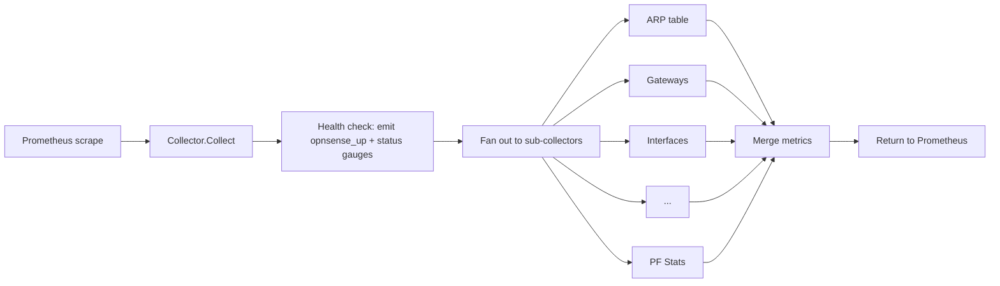

# Collectors

The OPNsense Exporter runs 49 sub-collectors concurrently via goroutines, each targeting a specific OPNsense subsystem. On every Prometheus scrape, all enabled collectors fan out in parallel, query the OPNsense REST API, and emit their metrics.

## Scrape flow

```mermaid
graph LR
    A[Prometheus scrape] --> B[Collector.Collect]
    B --> C[Health check: emit opnsense_up + status gauges]
    C --> E[Fan out to sub-collectors]
    E --> G1[ARP table]
    E --> G2[Gateways]
    E --> G3[Interfaces]
    E --> G4[...]
    E --> G5[PF Stats]
    G1 --> H[Merge metrics]
    G2 --> H
    G3 --> H
    G4 --> H
    G5 --> H
    H --> I[Return to Prometheus]
```

## Auto-registration pattern

Sub-collectors register themselves via `init()` functions that append to a global `collectorInstances` slice. Adding a new collector requires only creating the file with an `init()` function -- no manual registration is needed. See [Adding a Collector](../development/adding-collector.md) for details.

## Top-level exporter metrics

These metrics are always emitted regardless of which sub-collectors are enabled:

| Metric | Type | Description |
|--------|------|-------------|
| `opnsense_up` | Gauge | Whether the OPNsense API was reachable on the last scrape (1 = reachable, 0 = unreachable/scrape failed). A reachable but degraded box stays 1 — see `opnsense_system_status_code` |
| `opnsense_firewall_status` | Gauge | Firewall health status from system health check (1 = ok, 0 = errors); absent when OPNsense is unreachable |
| `opnsense_crash_reporter_status` | Gauge | Crash reporter status (1 = ok/no crash reports, 0 = crash reports present); absent when OPNsense is unreachable |
| `opnsense_system_status_code` | Gauge | Numeric OPNsense system status code from health check (2 = OK, 1 = NOTICE, 0 = WARNING, -1 = ERROR; OPNsense >= 25.1); absent when unreachable |
| `opnsense_system_subsystem_status_code` | Gauge | Numeric SystemStatusCode for every health-check subsystem present in the response, by `subsystem` label (e.g. `diskspace`, `rootlock`, `crashreporter`, `firewall`, plugin overrides). OPNsense omits healthy subsystems, so a series is present only while unhealthy |
| `opnsense_exporter_scrapes_total` | Counter | Total number of scrapes performed |
| `opnsense_exporter_endpoint_errors_total` | Counter | Total API errors by endpoint |

## Collector reference

### Enabled by default

| Collector | Subsystem | Description | Disable flag |
|-----------|-----------|-------------|-------------|
| ARP table | `arp_table` | ARP cache entries | `--exporter.disable-arp-table` |
| Gateways | `gateways` | Gateway status, RTT, loss, configuration | Always enabled |
| Interfaces | `interfaces` | Interface traffic counters, packet totals, queue stats, link state, line rate | Always enabled |
| Protocol stats | `protocol` | CARP, pfsync, IP, TCP, ARP protocol statistics (39+ metrics) | Always enabled |
| Services | `services` | Service running status across all OPNsense services | Always enabled |
| Cron jobs | `cron` | Cron table entries | `--exporter.disable-cron-table` |
| WireGuard | `wireguard` | WireGuard tunnels, peers, transfer stats, service status | `--exporter.disable-wireguard` |
| IPsec | `ipsec` | IPsec tunnels, phase1/phase2 status, service status | `--exporter.disable-ipsec` |
| Unbound DNS | `unbound_dns` | DNS resolver statistics (30+ metrics), blocklist status, service status | `--exporter.disable-unbound` |
| OpenVPN | `openvpn` | OpenVPN instances, sessions, traffic | `--exporter.disable-openvpn` |
| Firewall | `firewall` | PF interface packet/byte counters (IPv4/IPv6 pass/block), state table, per-interface hits | `--exporter.disable-firewall` |
| Firewall rules | `firewall_rule` | Total rule count; opt-in per-rule detail metrics | `--exporter.disable-firewall-rules` |
| Firmware | `firmware` | Firmware version info, update status, reboot flags | `--exporter.disable-firmware` |
| System | `system` | Memory, uptime, load averages, disk/swap usage, system info | `--exporter.disable-system` |
| Temperature | `temperature` | Hardware temperature sensors | `--exporter.disable-temperature` |
| Dnsmasq DHCP | `dnsmasq` | DHCP leases (total, by interface, reserved vs dynamic) | `--exporter.disable-dnsmasq` |
| Mbuf stats | `mbuf` | FreeBSD network buffers, allocation failures, sendfile stats | `--exporter.disable-mbuf` |
| NTP | `ntp` | NTP peer metrics (stratum, delay, offset, jitter) | `--exporter.disable-ntp` |
| Certificates | `certificate` | Certificate validity timestamps, expiry monitoring | `--exporter.disable-certificates` |
| CARP/VIP | `carp` | CARP HA status, demotion counter, per-VIP state | `--exporter.disable-carp` |
| Activity | `activity` | CPU percentages (user/nice/system/interrupt/idle), thread counts | `--exporter.disable-activity` |
| Kea DHCP | `kea` | Kea DHCPv4/v6 leases (total, by interface, reserved vs dynamic) | `--exporter.disable-kea` |
| PF stats | `pf_stats` | PF state table, counters, limit counters, memory limits, timeouts | `--exporter.disable-pf-stats` |
| NDP | `ndp` | IPv6 neighbor discovery table entries | `--exporter.disable-ndp` |
| ISC DHCPv4 | `dhcpv4` | ISC DHCPv4 lease metrics (silent when the legacy ISC DHCP backend is absent) | `--exporter.disable-dhcpv4` |
| ACME client | `acme` | ACME certificate renewal status and expiry (silent when `os-acme-client` is absent) | `--exporter.disable-acme` |
| SMART disk health | `smart` | Per-disk SMART health, temperature, power-on hours (silent when `os-smart` is absent) | `--exporter.enable-smart` |
| DynDNS | `dyndns` | DynDNS (ddclient) account update status (silent when `os-ddclient` is absent) | `--exporter.disable-dyndns` |
| Syslog | `syslog` | syslog-ng per-destination processed/dropped/queued/written stats, truncation, memory, events-per-second | `--exporter.disable-syslog` |
| Q-Feeds | `qfeeds` | Q-Feeds threat-intel feed entries, blocked packets/bytes/addresses, license expiry (silent when `os-q-feeds-connector` is absent) | `--exporter.disable-qfeeds` |
| Tailscale | `tailscale` | Node-local Tailscale state: service/backend status, peer counts; opt-in per-peer details (silent when `os-tailscale` is absent) | `--exporter.disable-tailscale` |
| Firewall aliases | `alias` | pf alias table entry counts and global table used/limit; opt-in per-table pf counters | `--exporter.disable-alias` |

### Disabled by default (opt-in)

| Collector | Subsystem | Description | Enable flag |
|-----------|-----------|-------------|-------------|
| Network diagnostics | `network_diag` | Kernel netisr stats, socket counts, route counts, pfsync HA nodes | `--exporter.enable-network-diagnostics` |
| NetFlow | `netflow` | NetFlow service status, per-interface cache statistics | `--exporter.enable-netflow` |

### High-cardinality detail metrics

These produce one time series per item and should be evaluated carefully before enabling:

| Detail option | Parent collector | Enable flag |
|---------------|-----------------|-------------|
| Dnsmasq per-lease details | Dnsmasq DHCP | `--exporter.enable-dnsmasq-details` |
| Firewall per-rule details | Firewall rules | `--exporter.enable-firewall-rules-details` |
| Kea per-lease details | Kea DHCP | `--exporter.enable-kea-details` |
| ISC DHCPv4 per-lease details | ISC DHCPv4 | `--exporter.enable-dhcpv4-details` |
| Tailscale per-peer details | Tailscale | `--exporter.enable-tailscale-peer-details` |
| Alias per-table pf counters | Firewall aliases | `--exporter.enable-alias-details` |

!!! warning "Cardinality impact"
    Each active DHCP lease or firewall rule generates multiple time series when detail metrics are enabled. On a firewall with 500 DHCP leases, enabling Dnsmasq details creates approximately 500 additional time series. Monitor your Prometheus storage after enabling.

## Service running metrics

Several collectors include a `service_running` gauge (1 = running, 0 = stopped/disabled) for their respective services:

- Unbound DNS: `opnsense_unbound_dns_service_running`
- Dnsmasq: `opnsense_dnsmasq_service_running`
- IPsec: `opnsense_ipsec_service_running`
- WireGuard: `opnsense_wireguard_service_running`
- Syslog: `opnsense_syslog_service_running`
- Tailscale: `opnsense_tailscale_service_running`
- Kea: `opnsense_kea_service_running`

## Tailscale collector scope

The Tailscale collector is **complementary to
[tailscale2otel](https://github.com/rknightion/tailscale2otel)**, which covers
control-plane/fleet data from the Tailscale API. This exporter deliberately
emits only signals that exist solely on the firewall itself: per-peer
rx/tx traffic as seen from this node, and local WireGuard session state
derived purely from handshakes (`peer_session_active`,
`peers_with_active_session`, direct-vs-DERP path for established sessions,
last-handshake timestamps), plus the plugin/backend service state. The
coordination-server `Online` flag is intentionally **never parsed or
exported** — it is fleet data relayed to the node, not a local observation,
and it lives in tailscale2otel along with peer last-seen and exit-node
inventory. Per-peer metrics are opt-in via
`--exporter.enable-tailscale-peer-details`.
