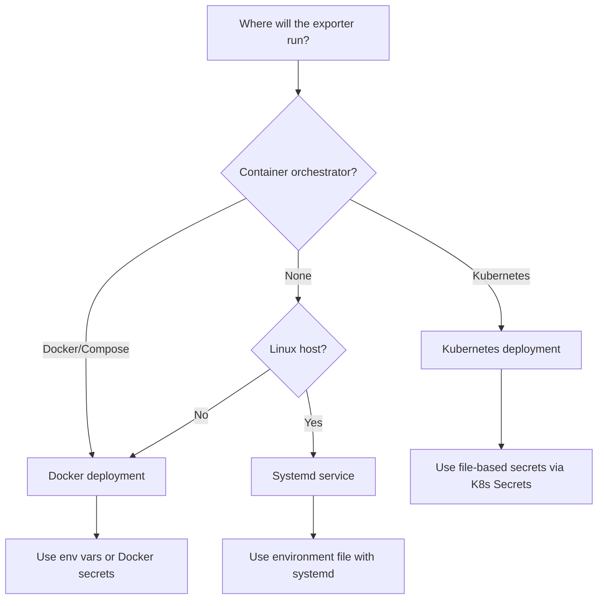

# Deployment

The OPNsense Exporter can run on any machine with network access to the OPNsense API -- it does not need to run on the firewall itself. Choose the deployment method that fits your infrastructure.

## Deployment options

| Method | Best for | Guide |
|--------|----------|-------|
| **Docker / Docker Compose** | Quick setup, homelab, single-host deployments | [Docker & Compose](deployment/docker.md) |
| **Kubernetes** | Production clusters, Prometheus Operator environments | [Kubernetes](deployment/kubernetes.md) |
| **Systemd** | Bare-metal Linux hosts, VMs | [Systemd](deployment/systemd.md) |

## Decision matrix

## Common considerations

### Resource requirements

In basic testing with a home lab OPNsense instance, the exporter uses approximately:

- **CPU:** 100m (request) / 500m (limit)
- **Memory:** 64Mi (request) / 128Mi (limit)

If your OPNsense instance has a large number of interfaces, firewall rules, or DHCP leases (especially with detail metrics enabled), you may need to increase these limits.

### Scrape interval

A 30-60 second scrape interval works well for most deployments. The exporter makes multiple API calls per scrape (one per enabled collector), so very aggressive intervals (under 15s) may put unnecessary load on the OPNsense API.

### Multiple OPNsense instances

To monitor multiple OPNsense firewalls, run a separate exporter instance for each, using a unique `--exporter.instance-label` value. The instance label is included on every metric, allowing you to filter and aggregate in PromQL.

### Security

See the [Security guide](security.md) for detailed guidance on:

- Creating least-privilege API keys
- Configuring TLS
- Using file-based secrets
- Required OPNsense user permissions
