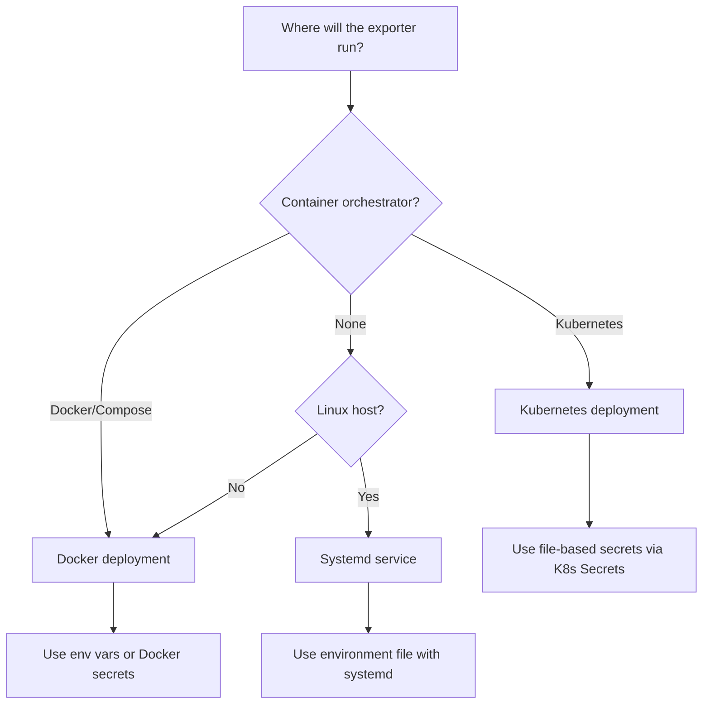

# Deployment

The OPNsense Exporter can run on any machine with network access to the OPNsense API -- it does not need to run on the firewall itself. Choose the deployment method that fits your infrastructure.

## Deployment options

| Method | Best for | Guide |
|--------|----------|-------|
| **Docker / Docker Compose** | Quick setup, homelab, single-host deployments | [Docker & Compose](deployment/docker.md) |
| **Kubernetes** | Production clusters, Prometheus Operator environments | [Kubernetes](deployment/kubernetes.md) |
| **Systemd** | Bare-metal Linux hosts, VMs | [Systemd](deployment/systemd.md) |

## Decision matrix

```mermaid
graph TD
    A[Where will the exporter run?] --> B{Container orchestrator?}
    B -->|Kubernetes| C[Kubernetes deployment]
    B -->|Docker/Compose| D[Docker deployment]
    B -->|None| E{Linux host?}
    E -->|Yes| F[Systemd service]
    E -->|No| D

    C --> G[Use file-based secrets via K8s Secrets]
    D --> H[Use env vars or Docker secrets]
    F --> I[Use environment file with systemd]
```

## Common considerations

### Resource requirements

In basic testing with a home lab OPNsense instance, the exporter uses approximately:

- **CPU:** 100m (request) / 500m (limit)
- **Memory:** 64Mi (request) / 128Mi (limit)

If your OPNsense instance has a large number of interfaces, firewall rules, or DHCP leases (especially with detail metrics enabled), you may need to increase these limits.

### Scrape interval

A 30-60 second scrape interval works well for most deployments. The exporter makes multiple API calls per scrape (one per enabled collector), so aggressive intervals (under 15s) may put unnecessary load on the OPNsense API.

### Multiple OPNsense instances

To monitor multiple OPNsense firewalls, run a separate exporter instance for each, using a unique `--exporter.instance-label` value. The instance label is included on every metric, allowing you to filter and aggregate in PromQL.

### Security

See the [Security guide](security.md) for detailed guidance on:

- Creating least-privilege API keys
- Configuring TLS
- Using file-based secrets
- Required OPNsense user permissions

## Web UI (operator console)

When the metrics path is not `/`, the exporter serves a built-in operator console at `/` (in place of the minimal landing page). It is a set of server-rendered pages for inspecting the exporter's own health at a glance:

- **Status** (`/`) — overall health, per-collector run stats (success rate, last-scrape duration, a duration sparkline and pass/fail strip, staleness, last error), a **Run Now** button per collector, the response-cache freshness table, and API-request stats. Live-updates in place.
- **Cardinality** (`/cardinality`) — total series and metric families, the highest-cardinality metrics and labels, threshold alerts/recommendations, per-metric label-value drill-downs, series growth-rate, and a JSON export.
- **Config** (`/config`) — the effective runtime configuration, with every secret redacted.
- **Devices** (`/devices`) — connected devices merged from the ARP table and DHCP leases (IP, MAC, hostname, interface, manufacturer).

The console reads only cached/last-scrape data, so opening it never triggers an extra scrape of the firewall.

It is on by default and served without authentication, so expose the exporter's port only on a trusted network. Controls:

- `--web.ui-enabled` — set to false to serve the minimal landing page instead of the console.
- `--web.ui-disable-config` / `--web.ui-disable-devices` — hide the config or devices page (the devices page exposes device MACs/hostnames).
- `--web.ui-refresh-interval` — how often the live pages poll for updates.

See the [Configuration reference](configuration.md) for the full flag/env details.
