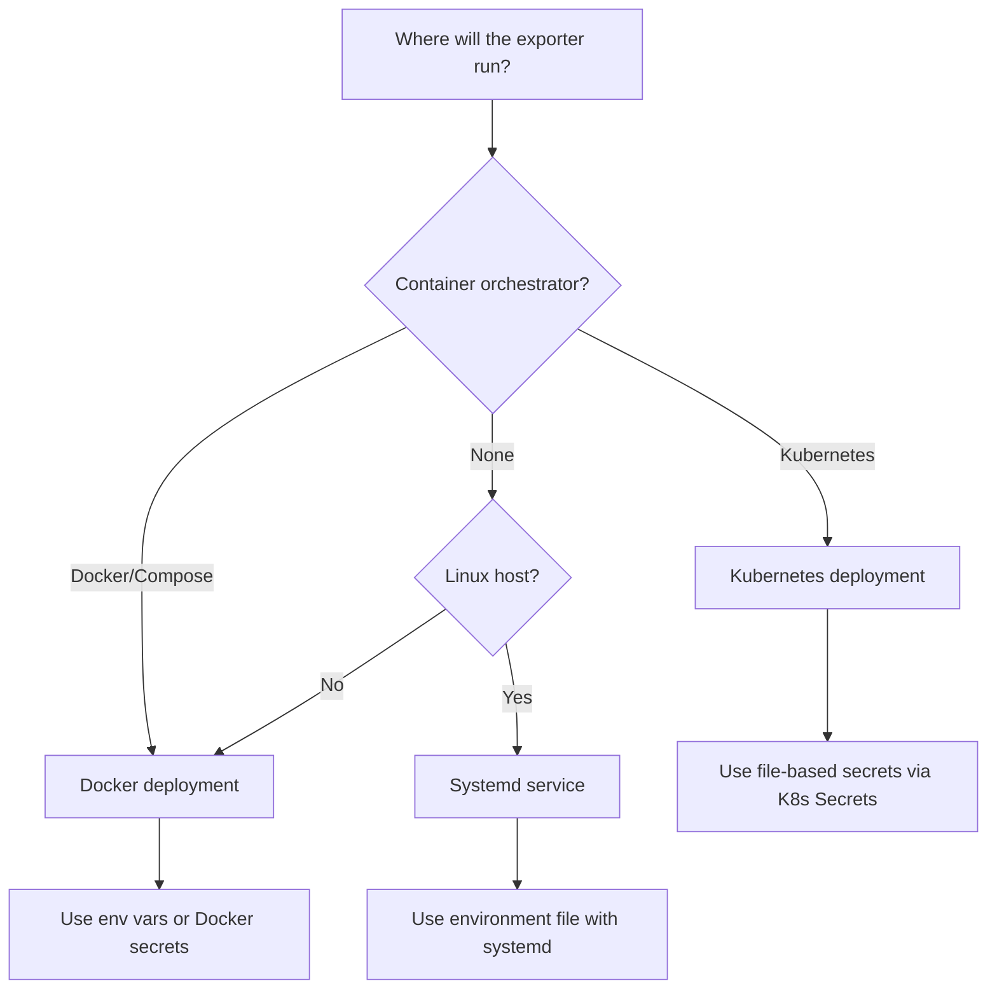

# Deployment

opnsense2otel can run on any machine with network access to the OPNsense API. It does not need to run on the firewall itself. Choose the deployment method that fits your infrastructure.

Container images are published to
[`ghcr.io/rknightion/opnsense2otel`](https://github.com/rknightion/opnsense2otel/pkgs/container/opnsense2otel),
and static binaries for each release are attached to the
[GitHub releases page](https://github.com/rknightion/opnsense2otel/releases). Ready-made
Kubernetes manifests live in
[`deploy/k8s/`](https://github.com/rknightion/opnsense2otel/tree/main/deploy/k8s).

## Deployment options

| Method | Best for | Guide |
|--------|----------|-------|
| **Docker / Docker Compose** | Quick setup, homelab, single-host deployments | [Docker & Compose](deployment/docker.md) |
| **Kubernetes** | Production clusters, Prometheus Operator environments | [Kubernetes](deployment/kubernetes.md) |
| **Systemd** | Bare-metal Linux hosts, VMs | [Systemd](deployment/systemd.md) |

## Decision matrix

```mermaid
graph TD
    A[Where will the exporter run?] --> B{Container orchestrator?}
    B -->|Kubernetes| C[Kubernetes deployment]
    B -->|Docker/Compose| D[Docker deployment]
    B -->|None| E{Linux host?}
    E -->|Yes| F[Systemd service]
    E -->|No| D

    C --> G[Use file-based secrets via K8s Secrets]
    D --> H[Use env vars or Docker secrets]
    F --> I[Use environment file with systemd]
```

## Common considerations

### Resource requirements

In basic testing with a home lab OPNsense instance, the exporter uses approximately:

- **CPU:** 100m (request) / 500m (limit)
- **Memory:** 64Mi (request) / 128Mi (limit)

If your OPNsense instance has a large number of interfaces, firewall rules, or DHCP leases (especially with detail metrics enabled), you may need to increase these limits.

### Scrape interval

A 30-60 second Prometheus scrape interval works well for most deployments. Scrapes replay an in-memory snapshot and do not call OPNsense, so increasing scrape frequency does not increase firewall load. Tune firewall load with collector poll intervals, per-poll deadlines, and `--opnsense.max-concurrent-requests`.

### Multiple OPNsense instances

To monitor multiple OPNsense firewalls, run a separate exporter instance for each, using a unique `--exporter.instance-label` value. The instance label is included on every metric, allowing you to filter and aggregate in PromQL.

### Security

See the [Security guide](security.md) for:

- Creating least-privilege API keys
- Configuring TLS
- Using file-based secrets
- Required OPNsense user permissions

## Web UI (operator console)

When the metrics path is not `/`, set `--web.ui-enabled=true` to serve the built-in operator console at `/` in place of the default minimal landing page. It is a single server-rendered page with a sticky tab bar, inline CSS/JS and zero external assets, a light/dark theme toggle, and a live poll-and-patch refresh (with Pause/Resume, an "updated Ns ago" freshness ticker, and a disconnect banner). The tabs:

- **Overview** - health verdict, uptime, series/family/collector counts, a ~10-minute runtime trend (goroutines, heap-in-use, GC rate, active series), and a throughput & fleet trend (log records shipped/dropped per second, collectors failing, mean run duration). The throughput chart covers the exporter's one push path - the OTLP log-shipping pipeline - so it stays empty unless `--logs.enabled` is set; `/metrics` is pulled, not emitted, so it has no per-second emit rate to chart.
- **Collectors** - per-collector run stats: state, poll **Interval**, success rate, **Freshness**, runs/failures, **Next run** countdown, last duration (with a sparkline and pass/fail strip), and last error. Fed by the internal poll scheduler.
- **API** - auth status and the exporter's OPNsense API-request stats, with a top-endpoint-errors table.
- **Cardinality** - total series and metric families, the highest-cardinality metrics and labels, series growth-rate, and a JSON export (`/cardinality/export.json`, `/api/cardinality.json`).
- **Config** - the effective runtime configuration, with every secret redacted (rendered once per page load, not on the refresh poll).
- **Devices** - connected devices merged from the ARP table and DHCP leases (IP, MAC, hostname, interface, manufacturer). Loads on demand when you open the tab.

The console is read-only. It reads only cached/last-scrape data, so the auto-refresh never triggers an extra scrape of the firewall; the Devices tab is the only view that reaches the firewall (ARP/DHCP), and only when you open it.

Every console response carries a Content-Security-Policy that authorizes the page's inline scripts and styles with a fresh request nonce, allows self-hosted fonts and same-origin polling, and blocks external resources, framing, form submissions and base-URL overrides. Responses also use `X-Content-Type-Options: nosniff`, `Referrer-Policy: no-referrer` and `Cache-Control: no-store`; bundled fonts retain their immutable caching. The console has no TLS listener of its own, so it does not send HSTS. Normal operation is unchanged; embedding the console in a frame or injecting an operator-supplied script now fails.

It is off by default. When enabled, it is served without authentication, so expose the exporter's port only on a trusted network. Controls:

- `--web.ui-enabled` - set to true to serve the console instead of the default minimal landing page.
- `--web.ui-disable-config` / `--web.ui-disable-devices` - hide the Config or Devices tab (the Devices tab exposes device MACs/hostnames, and its JSON endpoint returns 404 when disabled).
- `--web.ui-refresh-interval` - how often the console polls for updates (default 5s).

See the [Configuration reference](configuration.md) for the full flag/env details.
