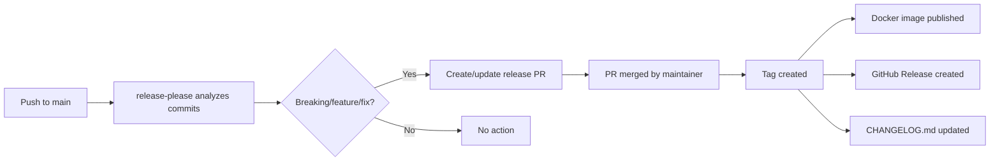

# Release Process

The OPNsense Exporter uses automated release management powered by [release-please](https://github.com/googleapis/release-please) and conventional commit messages.

## How it works



### 1. Conventional commits

All commits to `main` must follow the [conventional commits](https://www.conventionalcommits.org/) format:

| Prefix | Version bump | Example |
|--------|-------------|---------|
| `feat:` | Minor (0.x.0) | `feat(collector): add NDP table collector` |
| `fix:` | Patch (0.0.x) | `fix(kea): handle disabled DHCP response` |
| `feat!:` or `BREAKING CHANGE:` | Major (x.0.0) | `feat!: remove deprecated gateway labels` |
| `docs:` | No bump | `docs: update README` |
| `refactor:` | No bump | `refactor: modernize Go syntax` |
| `test:` | No bump | `test: add collector test coverage` |
| `ci:` | No bump | `ci: update workflow actions` |

Scopes are optional but encouraged. Common scopes: `collector`, `client`, `options`, `kea`, `firewall`, etc.

### 2. Release PR

When commits with `feat:` or `fix:` prefixes land on `main`, release-please automatically creates or updates a release PR. This PR:

- Bumps the version in the `VERSION` file
- Updates `CHANGELOG.md` with all changes since the last release
- Shows the proposed version bump in the PR title

### 3. Publishing

When a maintainer merges the release PR:

1. release-please creates a Git tag (e.g., `v0.2.0`)
2. The CI workflow builds and publishes multi-architecture Docker images:
   - `ghcr.io/rknightion/opnsense-exporter:v0.2.0`
   - `ghcr.io/rknightion/opnsense-exporter:latest`
3. A GitHub Release is created with the changelog entry

## Docker images

### Registry

Images are published to GitHub Container Registry:

```
ghcr.io/rknightion/opnsense-exporter
```

### Tags

| Tag | Description |
|-----|-------------|
| `latest` | Most recent release |
| `v0.1.0` | Specific version |

### Architectures

Each image is a multi-architecture manifest supporting:

- `linux/amd64`
- `linux/arm64`

### Build details

- **Builder stage:** Alpine-based with BuildKit cache mounts
- **Runtime stage:** Distroless Debian 13 (nonroot), pinned by digest
- **Binary:** Static, CGO disabled, `-trimpath`, `-mod=vendor`

## VERSION file

The `VERSION` file at the repository root contains the current version string. It is:

- Updated automatically by release-please during releases
- Read at build time and embedded in the binary via `-ldflags`
- Reported in the exporter's landing page and startup logs

## GitHub Actions

### CI workflow (`ci.yml`)

Runs on every push and PR:

- Go build
- Go test (`go test ./...`)
- Linting (`golangci-lint`)

### Release workflow (`release-please.yml`)

Runs on push to `main`:

- Analyzes conventional commits
- Creates/updates release PR
- On merge: tags, builds Docker images, creates GitHub Release

### All actions pinned to commit hashes

All GitHub Actions are pinned to commit SHAs rather than version tags for supply-chain security:

```yaml
# Good
uses: actions/checkout@8ade135a41bc03ea155e62e844d188df1ea18608

# Avoid
uses: actions/checkout@v4
```
