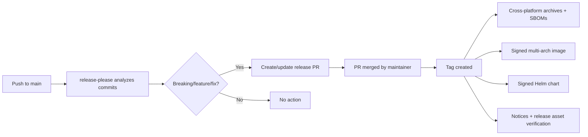

# Release Process

The OPNsense Exporter uses automated release management powered by [release-please](https://github.com/googleapis/release-please) and conventional commit messages.

## How it works


```mermaid
graph LR
    A[Push to main] --> B[release-please analyzes commits]
    B --> C{Breaking/feature/fix?}
    C -->|Yes| D[Create/update release PR]
    C -->|No| E[No action]
    D --> F[PR merged by maintainer]
    F --> G[Tag created]
    G --> H[Cross-platform archives + SBOMs]
    G --> I[Signed multi-arch image]
    G --> J[Signed Helm chart]
    G --> K[Notices + release asset verification]
```

### 1. Conventional commits

All commits to `main` must follow the [conventional commits](https://www.conventionalcommits.org/) format:

| Prefix | Version bump | Example |
|--------|-------------|---------|
| `feat:` | Minor (0.x.0) | `feat(collector): add NDP table collector` |
| `fix:` | Patch (0.0.x) | `fix(kea): handle disabled DHCP response` |
| `feat!:` or `BREAKING CHANGE:` | Major (x.0.0) | `feat!: remove deprecated gateway labels` |
| `docs:` | No bump | `docs: update README` |
| `refactor:` | No bump | `refactor: modernize Go syntax` |
| `test:` | No bump | `test: add collector test coverage` |
| `ci:` | No bump | `ci: update workflow actions` |

Scopes are optional but encouraged. Common scopes: `collector`, `client`, `options`, `kea`, `firewall`, etc.

### 2. Release PR

When commits with `feat:` or `fix:` prefixes land on `main`, release-please automatically creates or updates a release PR. This PR:

- Bumps the version in the `version.txt` file
- Updates `CHANGELOG.md` with all changes since the last release
- Shows the proposed version bump in the PR title

### 3. Publishing

When a maintainer merges the release PR:

1. release-please creates a Git tag (e.g., `v0.2.0`)
2. The binary workflow publishes release archives for Linux, macOS, FreeBSD,
   OpenBSD, and Windows, plus per-archive SBOMs, checksums, keyless signature
   bundle, and provenance.
3. The image workflow publishes a signed, attested multi-architecture image and
   release-level CycloneDX and SPDX SBOMs.
4. The same workflow packages and signs the Helm chart, pushes it to
   `oci://ghcr.io/rknightion/charts/opnsense-exporter`, and attaches
   `opnsense-exporter-<version>.tgz` to the GitHub release.
5. The notices job generates `THIRD_PARTY_NOTICES.md` from the tagged source.
6. A final read-back job rejects a partial release if any mandatory asset is
   absent.

## Docker images

### Registry

Images are published to GitHub Container Registry:

```text
ghcr.io/rknightion/opnsense-exporter
```

### Tags

| Tag | Description |
|-----|-------------|
| `latest` | Most recent release |
| `3.0.0` | Specific version; image tags have no leading `v` |

### Architectures

Each image is a multi-architecture manifest supporting:

- `linux/amd64`
- `linux/arm64`

Git tags and release names include the leading `v` (`v3.0.0`); container tags do
not (`3.0.0`).

## Mandatory GitHub release assets

Every tagged release must contain:

- Nine platform archives: Darwin, FreeBSD, Linux, and OpenBSD on arm64 and
  x86_64, plus Windows x86_64.
- One `.sbom.json` beside each archive.
- `checksums.txt`, its Sigstore bundle, and its in-toto provenance.
- `opnsense-exporter.cdx.json` and `opnsense-exporter.spdx.json`.
- `THIRD_PARTY_NOTICES.md`.
- `opnsense-exporter-<version>.tgz`, the signed chart package also published to
  GHCR as an OCI artifact.

The release workflow reads the published release back and checks this exact set.
Notices are generated from the tag rather than current `main`, so their dependency
set matches the binaries they accompany.

<!-- docgen:begin:release-assets -->
- `THIRD_PARTY_NOTICES.md`
- `checksums.txt`
- `checksums.txt.intoto.jsonl`
- `checksums.txt.sigstore.json`
- `opnsense-exporter.cdx.json`
- `opnsense-exporter.spdx.json`
- `opnsense-exporter_Darwin_arm64.tar.gz`
- `opnsense-exporter_Darwin_arm64.tar.gz.sbom.json`
- `opnsense-exporter_Darwin_x86_64.tar.gz`
- `opnsense-exporter_Darwin_x86_64.tar.gz.sbom.json`
- `opnsense-exporter_Freebsd_arm64.tar.gz`
- `opnsense-exporter_Freebsd_arm64.tar.gz.sbom.json`
- `opnsense-exporter_Freebsd_x86_64.tar.gz`
- `opnsense-exporter_Freebsd_x86_64.tar.gz.sbom.json`
- `opnsense-exporter_Linux_arm64.tar.gz`
- `opnsense-exporter_Linux_arm64.tar.gz.sbom.json`
- `opnsense-exporter_Linux_x86_64.tar.gz`
- `opnsense-exporter_Linux_x86_64.tar.gz.sbom.json`
- `opnsense-exporter_Openbsd_arm64.tar.gz`
- `opnsense-exporter_Openbsd_arm64.tar.gz.sbom.json`
- `opnsense-exporter_Openbsd_x86_64.tar.gz`
- `opnsense-exporter_Openbsd_x86_64.tar.gz.sbom.json`
- `opnsense-exporter_Windows_x86_64.zip`
- `opnsense-exporter_Windows_x86_64.zip.sbom.json`
<!-- docgen:end:release-assets -->

### Build details

- **Builder stage:** Alpine-based with BuildKit cache mounts
- **Runtime stage:** Distroless Debian 13 (nonroot), pinned by digest
- **Binary:** Static, CGO disabled, `-trimpath`, `-mod=vendor`

## version.txt file

The `version.txt` file at the repository root contains the current version string. It is:

- Updated automatically by release-please during releases
- Used by release-please to track the current release; the binary version is embedded via `-ldflags -X main.version=...` using the git tag (not read from this file at build time)
- Reported in the exporter's startup logs

## GitHub Actions

### CI workflow (`ci.yml`)

Runs on every push and PR:

- Go build (`CGO_ENABLED=0 go build ./...`)
- Go test (`go test ./...`)
- Race detector (`go test -race ./...`, dedicated `race` job) - a data-race failure is **blocking**: the `race` job feeds `ci-success`, so a race must be fixed before a release PR can merge
- Generated documentation (`make docs-check`)
- Grafana builders and generated artifacts (`make grafana-test` and
  `make grafana-check`)
- The release Dockerfile, embedded version, Compose file-secret readability, and
  the native container healthcheck

### Release workflow (`release-please.yml`)

Runs on push to `main`:

- Analyzes conventional commits
- Creates/updates release PR
- On merge: tags, builds Docker images, creates GitHub Release

### All actions pinned to commit hashes

All GitHub Actions are pinned to commit SHAs rather than version tags for supply-chain security:

```yaml
# Good
uses: actions/checkout@8ade135a41bc03ea155e62e844d188df1ea18608

# Avoid
uses: actions/checkout@v4
```
